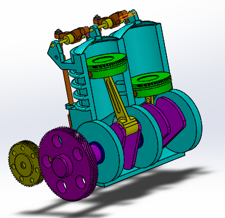
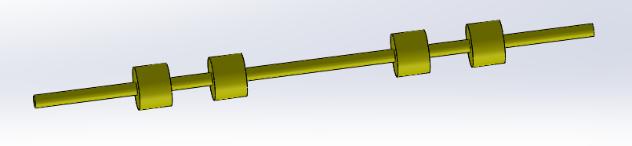
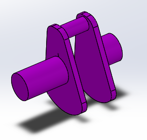
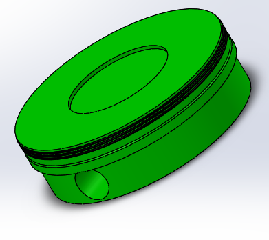
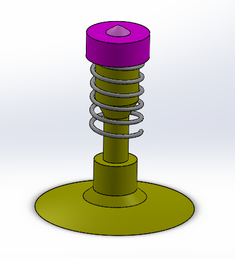

# Engine

### Working of engine.

## Assembly

## Parts 

### 1. Engine Block

### 2. Connecting rod

### 3. Camshaft with sprocket

### 4. Arbour

### 5.CRANK SPROCKET

### 6. Crankshaft

### 7. Piston

### 8. Piston Valve

### 9. Rocker arm

### 10. PUSH ROD

### 11. Piston pin

